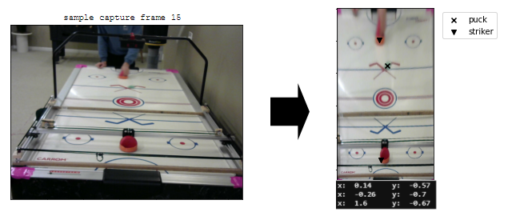

## HockeyJockey: Mastering Airhockey with RL
***********

A personal project with the goal of achieving human level Air Hockey proficency with reinforcement learning.

<kbd></kbd>

********
### Files:

**env.py :** Model of environment used for model + robot

**robots.py :** Classes for interacting with and simulating interactions with the Airhockey robot

**image_processing.py :** Image processing utils

**simulation_env.py :** Simulation envorinments for training models

**train.py :** Model trainers

**model.py :** Actor-Critic model (pytorch)

**test.py :** Simulate and render games to observe
